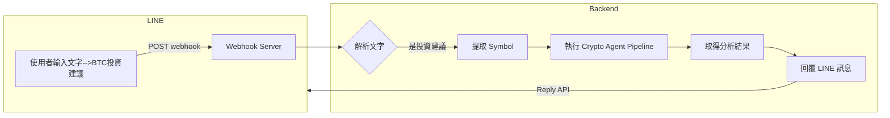

# Crypto-AI-Agent-Framework

以 **AI Agent Framework** 為核心概念，嘗試將多代理（Data / Analysis / Advice / Interface）的分工，實作在加密貨幣現貨投資場景上。  
目前先聚焦在 **BTC 現貨、長週期判趨勢＋短週期量價輔助判斷**，作為讀書會與個人實驗用專案。

---

## 🧾 為什麼需要 Crypto AI Agent？

<!--  -->


傳統在幣圈要做決策，往往需要同時關注：

- 宏觀指標：通膨、利率、就業、貨幣政策…
- 鏈上數據：交易量、資金流向、大戶/礦工動向…
- 幣圈內生指標：期貨資金費率、未平倉量、機構動態、情緒/FUD/FOMO…
- 技術分析：K 線、均線、量價、指標（MACD、RSI、布林帶…）
- 生態趨勢：L2、Rollup、RWA、DeFi、NFT、GameFi、AI 叙事…

對於 **有本業、時間有限的散戶** 來說，很難每天都花大把時間追資訊還要自己下結論。

所以這個專案想做的是：

> 讓 AI Agent 幫忙做「資料整理與大方向判讀」，  
> 我只要在忙碌生活中打開 LINE 問一句「現在 BTC 形勢怎樣？」  
> 就能用 10 秒掌握 **長週期趨勢 + 短週期量價狀態 + 風險提醒**。

---

## 🧠 Crypto AI Agent 架構圖

### 初始版本：

```mermaid
flowchart LR
    U["使用者 LINE 聊天"] -->|輸入指令：查 BTC 形勢| L["LINE Messaging API Bot"]

    subgraph GCP["GCP Serverless（Cloud Run ／ Functions）"]
        L --> W["Webhook Handler<br/>(HTTP Endpoint)"]
        W --> D["Data Agent<br/>抓幣安 K 線與量價"]
        D --> A["Analysis Agent<br/>週線 SMA50／100 牛熊判斷<br/>＋ 日線量價放量／縮量"]
        A --> Adv["Advice Agent<br/>呼叫 OpenAI API LLM"]
        Adv --> W
    end

    W -->|文字訊息| L
    L -->|回覆當前 BTC 形勢與建議| U
````

### Agent 職責說明

* **Data Agent**
  從 Binance 抓取：

  * BTC 現貨 K 線（週線、日線）
  * 價格與成交量（量價資料）

* **Analysis Agent**
  負責技術判斷：

  * **週線 SMA50／SMA100** → 判定 Bull / Bear / Warning / Neutral（長週期 Regime）
  * **日線量價型態** → 判斷放量下跌／放量上漲／縮量上漲／縮量橫盤… 等狀態

* **Advice Agent**
  使用 OpenAI LLM（之後可替換為 Ollama、vLLM、OpenRouter 等）：

  * 將長週期 Regime(市場景況) + 日線量價狀態，整理成 **人類可讀的中文說明**
  * 產出偏「現貨長線、風險控管」的建議，而不是報明牌／精準價格預測

* **Interface Agent**

  * LINE Bot（LINE Messaging API）
  * 部署在 GCP Serverless（Cloud Run／Cloud Functions）
  * 當使用者在 LINE 輸入「查 BTC 形勢」時才觸發運算 → 平時不佔資源

> 🎯 目標：不是做高頻交易機器人，而是打造一個「**中長線現貨投資顧問型 AI Agent**」。

### 更新 - 加入 LangGraph & Langfuse 框架版本：

```mermaid
flowchart LR
    %% === Entry ===
    A[使用者 / Cron<br/>python run_local.py] --> B[LangGraph StateGraph<br/>AgentState]

    %% === LangGraph Pipeline ===
    subgraph Pipeline["LangGraph Pipeline（Crypto Agent）"]
        F[fetch_and_analyze<br/>Binance K 線 + 指標計算]
        P[build_prompt<br/>build_prompt_for_llm]
        L[call_llm<br/>LLMClient（Ollama / OpenAI）]
        M[format_message<br/>format_line_message]

        F --> P --> L --> M
    end

    B --> F
    M --> OUT[最終訊息<br/>（給 LINE / Console 顯示）]

    %% === LLM Backend ===
    subgraph LLMBackend["LLM Backend"]
        O[OllamaLLM<br/>model: llama3.2:3b<br/>ngrok OLLAMA_HOST]
    end

    L --> O

    %% === Langfuse Observability ===
    subgraph Langfuse["Langfuse（Tracing / Spans）"]
        T[Trace<br/>crypto-agent.pipeline.SYMBOL]

        S1[Span<br/>fetch_and_analyze]
        S2[Span<br/>build_prompt]
        S3[Span<br/>call_llm]
        S4[Span<br/>format_message]

        T --> S1 --> S2 --> S3 --> S4
    end

    %% LangGraph nodes <-> Langfuse spans（觀測）
    F -. 建立 span .-> S1
    P -. 建立 span .-> S2
    L -. 建立 span .-> S3
    M -. 建立 span .-> S4

    %% === Langfuse infra (docker compose) ===
    subgraph LangfuseStack["Langfuse Self-host Stack（docker-compose）"]
        DB[(Postgres<br/>主資料庫)]
        CK[(ClickHouse<br/>事件 / 向量資料)]
        R[(Redis<br/>queue / cache)]
        MIN[(Minio<br/>S3 物件儲存)]
    end

    Langfuse --- LangfuseStack
```

1. 在 Langfuse 的 **Tracing → Traces** 裡，
   選對應專案與對應 trace name
   
2. 點進任一 trace：

   * 左邊是「整條流程」的 timeline
   * 中間選不同 span

     * `fetch_and_analyze` 看 Binance 抓回來的 regime / pattern / summary
     * `build_prompt` 看最後丟給 LLM 的 prompt
     * `call_llm...` 看 LLM summary 原文
     * `format_message` 看最後要送 LINE 的訊息

---

### 更新 - LINE Bot：



---

## 🗂 Crypto AI Agent 專案結構

```text
crypto_agent/
  config.py             # 環境變數、常數設定
  data_binance.py       # Data Agent：抓幣安 K 線 + 量價
  indicators.py         # Analysis Agent：技術指標計算 & 牛熊判斷 + 量價分析
  llm_client.py         # Advice Agent：OpenAI LLM 包裝（之後可改 OpenRouter / Ollama / vLLM 等）
  line_formatter.py     # 把分析結果 + LLM 回應，組成適合 LINE 顯示的訊息
  run_local.py          # 本地測試用：模擬一次「查詢現在 BTC 形勢」完整流程
  requirements.txt      # Python 相依套件
  .env                  # 本機環境變數與密鑰（不應提交到版本控制）
```

> `run_local.py`：
> 可先在自己機器上測試完整流程：
> **「抓資料 → 計算技術指標 → 判斷 Regime → 丟給 LLM 產生建議」**
> 確認輸出合理後，再接上 LINE Webhook ＋ 部署到 GCP。

### 本地執行時，crypto_agent中需加入`.env`檔案，加入自己的Key:

```
OPENAI_API_KEY=
OPENAI_MODEL=gpt-4o-mini
BINANCE_API_KEY=
BINANCE_API_SECRET=
SYMBOL=BTCUSDT
# ---- LLM backend 選擇( ollama / openai ) ----
LLM_BACKEND=ollama
# 在 OLLAMA 裡預先 pull 的模型名稱
OLLAMA_MODEL=llama3.2:3b
# LangChain Ollama URL
OLLAMA_BASE_URL=
# LangFuse 設定
LANGFUSE_ENABLED=true
LANGFUSE_PUBLIC_KEY=
LANGFUSE_SECRET_KEY=
LANGFUSE_BASE_URL=http://localhost:3000
# Line Bot 設定
LINE_CHANNEL_SECRET=
LINE_CHANNEL_TOKEN=
```

裝好套件（專案資料夾裡）：

```
pip install -r requirements.txt
```

然後執行：

```
python run_local.py
```

接下來程式的預期流程大概是：

- data_binance.py 用 BINANCE_* 去抓 BTC 週線＋日線 K 線 & 量價

- indicators.py 算出週線 Regime（Bull/Bear/Warning/Neutral）＋ 日線量價型態

- llm_client.py 用 OPENAI_API_KEY call OpenAI，生成一段中文說明

- run_local.py 把整段結果 print 在 terminal（之後才會改成傳到 LINE）

假設使用ollama需要切換主機：
```
export OLLAMA_HOST=<URL>   #指定 HOST
ollama pull llama3.2:3b  #拉取
ollama run llama3.2:3b   #測試
```

LangFuse docker-compose.yml 參考：
```
https://github.com/langfuse/langfuse/blob/main/docker-compose.yml
```

Line Bot 本機測試 Webhook（ngrok）：
```
ngrok http 8000
python -m uvicorn crypto_agent.main:app --reload --port 8000
crypto_agent 根目錄下 python -m uvicorn main:app --reload --port 8000 
```

取到的網址假設是：
```
https://abcd1234.ngrok.io/webhook
```

把它貼到 LINE Developer Console 的 Webhook URL 欄位。

---

## 🔍 Observability：使用 Langfuse 觀測整個 Agent Pipeline

已經整合 [Langfuse](https://langfuse.com/) 做觀測與除錯，目前支援：

- 以 **LangGraph pipeline** 為單位建立一條 Trace  
- 在 Trace 底下建立節點級的 Spans：
  - `fetch_and_analyze`（抓 Binance K 線 + 指標計算）
  - `build_prompt`（組 prompt 給 LLM）
  - `call_llm.*`（實際呼叫 LLM）
  - `format_message`（組成最後要丟 LINE 的訊息）

### 2.1 啟動本地 Langfuse

在 `crypto_agent/langfuse-local` 執行：

```bash
docker compose up -d
```

- Langfuse Web UI：http://localhost:3000

- Postgres / ClickHouse / Redis / Minio 皆在同一個 docker compose 中啟動

---

## 📊 Analysis Agent 指標 – 長週期策略邏輯（週線 SMA Regime）

> 站在「**長週期現貨投資者**」角度，評估：
> **週線 SMA50／SMA100 牛熊判斷 + 日線量價（放量／縮量）情況**，作為大方向的節奏判斷。

### 1️⃣ 週線 Regime 定義（Bull / Bear / Warning / Neutral）

**程式邏輯：** 使用 `compute_weekly_regime(df_weekly)`，與 TradingView PineScript 策略保持一致。

* **Bull（牛市）**：

  * 最近 **3 根週 K** 的收盤價都在 **週線 SMA50** 之上
  * 最新一週收盤價 > SMA50 × (1 + 2%)（可調參）
  * 且 SMA50 > SMA100（中期趨勢在長期趨勢之上）

  > 解讀：價格穩定站在中長期均線上方，且有一定「抬離」，屬於比較健康的牛市階段。

* **Bear（熊市）**：

  * 最近 **2 根週 K** 都收在 **SMA50 以下**
  * 最新一週收盤價 < SMA50 × (1 − 2%)（可調參）
  * 且收盤價 < SMA100

  > 解讀：不只是跌破 SMA50，而且持續兩週站不回去，還跌到更長週期均線下方，屬於確認進入熊市或長期下跌階段。

* **Warning（警戒區）**：

  * 剛剛跌破：本週收盤 < SMA50 且上週收盤仍在 SMA50 之上
  * 或者：收盤價在 SMA50 上下 ±1% 的小區間震盪

  > 解讀：牛轉熊的「過渡地帶」，不一定已經全面熊市，但風險明顯上升（常見於牛頂、頭部震盪階段）。

* **Neutral（中性）**：

  * 既不是明確 Bull，也不是明確 Bear，也不是剛跌破的 Warning

  > 解讀：偏向震盪、整理或資料還不夠清楚的區間。

### 2️⃣ 策略進出場邏輯（現貨、長週期）

這套邏輯在 PineScript 策略與 Python 分析中是一致的：

* **進場（建立多單／佈局核心倉位）**：

  * 當 Regime 從「不是 Bull」→「第一次被判定為 Bull」
  * 只在 **大趨勢由空手／不明 → 明確牛市** 的時刻進場
  * 適合作為「牛市中長線持有」的核心倉位判斷依據。

* **出場（清倉／空手觀望）**：

  * 當 Regime 從其他狀態變成 **Bear（熊市確認）**
  * 策略清空 Long 倉位 → 轉為空手等待
  * 直到下一次重新判定為 Bull 才再進場。

* **Warning（警戒）**：

  * 目前程式只做「標示狀態（背景顏色／文字提示）」，**不自動動作**。
  * 之後可以考慮進一步擴充：

    * Warning 出現連續 N 週 → 先減碼一部分
    * 或 Warning + 放量下跌 → 提示更強烈風險提醒

---

## 📉 Analysis Agent – 日線量價輔助判斷

程式會另外對 **日線 K 線 + 成交量** 做簡單分類，包含：

* 價格：上漲／下跌／持平（今日收盤 vs 昨日收盤）
* 量能：

  * 放量：今日量 > 近 N 日平均量 × `VOLUME_SPIKE_FACTOR`
  * 縮量：今日量 < 近 N 日平均量 × `VOLUME_DRY_FACTOR`
  * 正常：介於兩者之間

組合出幾種常見型態（`pattern`）：

* 放量上漲
* 縮量上漲
* 放量下跌
* 縮量下跌
* 放量橫盤
* 縮量橫盤
* 量價變化普通（無明顯特徵）

這些資訊會被丟給 Advice Agent 的 LLM，用來補充週線 Regime 的解讀，例如：

* 「週線仍是 Bull，但今日縮量下跌，暫時不構成結構性反轉」
* 「週線 Warning + 日線放量下跌，需留意可能進一步走向 Bear」
* 「週線 Bear，但日線放量上漲，只能先視為反彈，仍屬熊市結構內的技術反彈」

---

## 📈 Analysis Agent – TradingView 回測成果（BTCUSD 週線）

以下是將 Python 中的策略邏輯，轉寫成 TradingView PineScript 後，在 BTCUSD 週線上的回測結果截圖（Bitstamp，2011-08-15 ~ 2025-11-17）：

### 1. 週線 SMA50 / SMA100 參數設定

<!--  -->


* Weekly SMA 短期：50 週
* Weekly SMA 長期：100 週
* 牛市距離門檻：2%
* 熊市跌破門檻：2%
* SMA50 上下震盪帶（警戒）：1%

### 2. 策略屬性設定（現貨、全倉持有）


* 初始資本：100 USD（純作報酬倍數參考）
* Default order size：100% 權益（進場即全倉）
* 手續費：0.1%（模擬現貨交易成本）

### 3. 週線走勢與策略進出場標記


* 背景綠色：Bull Regime（牛市區間，持有現貨）
* 背景紅色：Bear Regime（熊市區間，空手）
* 背景橘色：Warning（警戒區）
* 圖上標記 Long / Bear Exit：實際的進出場點

可以清楚看到：

* 2013、2017、2020–2021 牛市都有長時間持有
* 在幾次大熊市來臨前，策略會觸發 Bear Exit → 空手避險

### 4. 策略績效摘要


* 淨利：約 +13,857%（從 100 → 約 13,957 USD）
* 勝率：100%（總共 3 筆交易，皆為大牛市波段）
* 最大資產回撤：約 14.5%
* 持有時間：約 1~2 年

> 解讀：策略非常「低頻」，但成功抓住了幾次比特幣的大牛市主升段，中間熊市則完全空手。

### 5. 交易分析


* 總交易量：3 筆（全部為多頭）
* 平均獲利交易：約 +497%
* 最大獲利交易：約 +969%
* 沒有虧損交易（因為只做大週期趨勢切換）

### 6. 風險 / 績效指標


* 夏普比率：約 0.125（長週期策略，持有時間極長）
* 獲利因子：接近 1,000（因為無虧損交易＋報酬極大）

對實務來說，這些數字是一個「**極度低頻、重倉順勢**」策略的典型樣貌。

### 7. 交易清單


清楚列出三筆交易的進出點、價格與報酬率：

1. 2013 牛市：約 +258%
2. 2016–2018 牛市：約 +969%
3. 2020–2025 牛市（未完全結束）：約 +108%（依目前時間截點而定）

> 這一組結果主要是想說明：
> **這個 Regime 判斷邏輯是有在實際歷史走勢上跑過回測的，而不是隨便亂畫的線。**
> 接下來 Python / Agent 端就是把這套邏輯搬到後端，用來給 AI Agent 判斷「現在大概在哪一個週期」。

---

### 初版串接成果

 

> 品質有待加強...

---

## 🛣 未來規劃（Roadmap）

短期：

* [x] 加入連接 langchain ollama (可切換ollama/OpenAI API)
* [ ] 加入 LINE Messaging API webhook，部署到 GCP Cloud Run
* [ ] 在 LINE 中用自然語言指令查詢，例如「查 BTC」「查 ETH」「幫我看週線」
* [ ] 增加簡單風險提示（例如：近期高波動、槓桿市場過熱等）

中期（跟讀書會題目對齊的部分）：

* [ ] 將目前的單流程拆成「顯式的多 Agent 流程節點」（更接近 LangGraph 的設計方式）
* [ ] 加入「簡單記憶」：記錄歷次判斷結果與後續走勢，用來調整規則或作為回顧素材
* [ ] 探索使用 LangChain / LangGraph 將各 Agent 串成可視化、可維護的工作流

長期（有空再玩）：

* [ ] 支援多幣種、多策略組合（非只 BTC）
* [ ] 加入鏈上數據（On-chain）、衍生品市場指標（Funding Rate / OI / Basis）
* [ ] 研究半自動或全自動下單流程（但需強化風控與監控）

---

## ⚠ 免責聲明

本專案僅作為：

* 個人技術練習
* AI Agent Framework 讀書會展示
* 自用觀察與研究工具

**不構成任何投資建議。**
加密貨幣波動極大，請自行評估風險與資金配置，勿槓桿梭哈、勿過度依賴模型或 AI 判斷。


