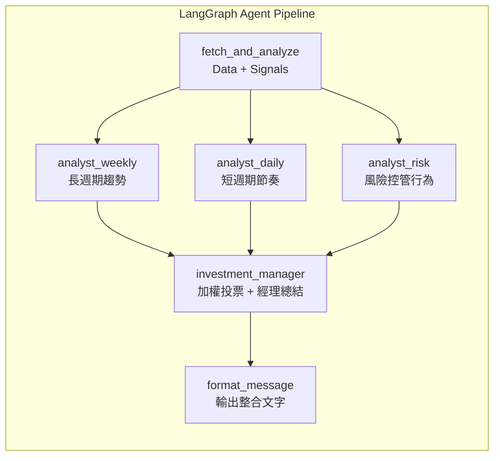
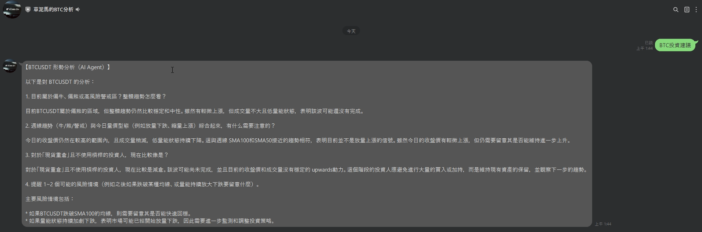
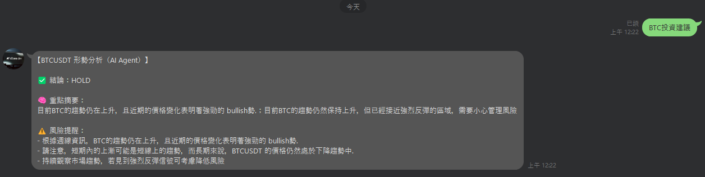

# Crypto-AI-Agent-Framework

以 **LangGraph + Langfuse** 為核心的「可觀測多角色 AI Agent Pipeline」，實作在加密貨幣（目前以 **BTC 現貨** 為主）的投資決策輔助場景。  
系統採用 **三位 LLM 分析師（週線趨勢 / 日線量價節奏 / 風險與倉位控管）** 共同評估，最後由 **投資經理節點（Intent 加權投票 + 經理人 LLM 總結）** 統整成 `buy / hold / sell` 建議，並透過 **LINE Bot** 以自然語言互動回覆；全流程輸入/輸出與每次 LLM 推論皆可在 **Langfuse Trace** 中追蹤與除錯。

---

## 🧾 為什麼需要 Crypto AI Agent？

<!--  -->


傳統在幣圈要做決策，往往需要同時關注：

- 宏觀指標：通膨、利率、就業、貨幣政策…
- 鏈上數據：交易量、資金流向、大戶/礦工動向…
- 幣圈內生指標：期貨資金費率、未平倉量、機構動態、情緒/FUD/FOMO…
- 技術分析：K 線、均線、量價、指標（MACD、RSI、布林帶…）
- 生態趨勢：L2、Rollup、RWA、DeFi、NFT、GameFi、AI 叙事…

對於 **有本業、時間有限的散戶** 來說，很難每天都花大把時間追資訊還要自己下結論。

所以這個專案想做的是：

> 讓 AI Agent 幫忙做「資料整理與大方向判讀」，  
> 我只要在忙碌生活中打開 LINE 問一句「現在 BTC 形勢怎樣？」  
> 就能用 10 秒掌握 **長週期趨勢 + 短週期量價狀態 + 風險提醒**。

---

## 🧠 Crypto AI Agent 架構圖

### 初始版本：

>（LINE → FastAPI → LangChain → Ollama/OpenAI → 回覆 LINE）

```mermaid
flowchart LR
    U["使用者 LINE 聊天"] -->|輸入指令：查 BTC 形勢| L["LINE Messaging API Bot"]

    subgraph GCP["GCP Serverless（Cloud Run ／ Functions）"]
        L --> W["Webhook Handler<br/>(HTTP Endpoint)"]
        W --> D["Data Agent<br/>抓幣安 K 線與量價"]
        D --> A["Analysis Agent<br/>週線 SMA50／100 牛熊判斷<br/>＋ 日線量價放量／縮量"]
        A --> Adv["Advice Agent<br/>呼叫 OpenAI / Ollama LLM"]
        Adv --> W
    end

    W -->|文字訊息| L
    L -->|回覆當前 BTC 形勢與建議| U
````

---

### Agent 職責說明

* **Data Agent**
  從 Binance 抓取：

  * BTC 現貨 K 線（週線、日線）
  * 價格與成交量（量價資料）

* **Analysis Agent**
  負責技術判斷：

  * **週線 SMA50／SMA100** → 判定 Bull / Bear / Warning / Neutral（長週期 Regime）
  * **日線量價型態** → 判斷放量下跌／放量上漲／縮量上漲／縮量橫盤… 等狀態

* **Advice Agent**
  使用 OpenAI LLM（之後可替換為 Ollama、vLLM、OpenRouter 等）：

  * 將長週期 Regime(市場景況) + 日線量價狀態，整理成 **人類可讀的中文說明**
  * 產出偏「現貨長線、風險控管」的建議，而不是報明牌／精準價格預測

* **Interface Agent**

  * LINE Bot（LINE Messaging API）
  * 部署在 GCP Serverless（Cloud Run／Cloud Functions）
  * 當使用者在 LINE 輸入「查 BTC 形勢」時才觸發運算 → 平時不佔資源

> 🎯 目標：不是做高頻交易機器人，而是打造一個「**中長線現貨投資顧問型 AI Agent**」。

---

## ✅ 更新版本：LangGraph + Langfuse（可觀測 Pipeline）

> （LINE → FastAPI → LangGraph → LLM → Langfuse → 回覆 LINE）

```mermaid
flowchart LR
    %% 使用者入口
    U[LINE 使用者 / CLI] --> L[LINE Platform]
    L -->|Webhook| A[FastAPI / webhook
    crypto_agent.main]

    %% 啟動 LangGraph
    A -->|run_with_graph
    symbol, intent| G[LangGraph StateGraph
    crypto_agent.graph_crypto_agent]

    %% LangGraph Pipeline
    subgraph G["LangGraph Pipeline（單一 Trace）"]
        S0((START))

        %% 市場資料
        S0 --> F[fetch_and_analyze
        抓 K 線 / 計算 signals]

        %% 三位分析師並行
        F --> W[analyst_weekly
        週線趨勢分析師
        LLM + signals → JSON]

        F --> D[analyst_daily
        日線量價型態分析師
        LLM + signals → JSON]

        F --> RSK[analyst_risk
        風險 / 倉位控管分析師
        LLM + signals → JSON]

        %% 投資經理彙整
        W --> M[investment_manager
        投資經理觀點
        加權 / 共識整合]
        D --> M
        RSK --> M

        %% 最終輸出（直接格式化）
        M --> FM[format_message
        轉為 LINE 訊息]

        FM --> E0((END))
    end

    %% 外部服務
    G --> LLM[(Ollama / OpenAI / vLLM / OpenRouter)]
    G --> FUSE[Langfuse
    Traces / Spans]

    %% 回傳使用者
    A -->|reply_message| L --> U
```

#### LangGraph（控制流程）

* 定義 **AgentState**（共享狀態）
* 定義節點（nodes）與執行順序
* 保證流程可重現、可擴充

#### Langfuse（觀測與除錯）

* **每一次使用者請求 → 一條 Trace**
* 每個節點 → 一個 Span
* 每次 LLM 呼叫 → 一個 Generation（`.llm`）

> 所有節點都在 **同一條 Trace 底下**，
> 可完整看到「資料 → 分析 → LLM → 決策 → 回覆」的時間線

---

## 🗂 Crypto AI Agent 專案結構 & 執行方式

```text
crypto_agent/
├ config.py               # API key 與環境變數設定（.env 讀取）
├ data_binance.py         # 從 Binance 拿日線/週線 K 線與量價資料
├ graph_crypto_agent.py   # LangGraph pipeline，將整個 Agent 流程串起
├ indicators.py           # 技術指標計算（SMA/Bull-Bear Regime）＋日線量價分析
├ line_formatter.py       # 將分析結果整合成適合 LINE 顯示的訊息格式
├ llm_client.py           # LLM 客戶端呼叫統一 interface（OpenAI / Ollama）
├ main.py                 # FastAPI + LINE Webhook 主入口（LINE Bot API）
├ observability.py        # Langfuse 觀測與 Span/GenCtx 定義封裝
├ run_local.py            # 本地測試腳本（模擬呼叫 Agent pipeline）
├ requirements.txt        # Python 相依套件列表
└ .env                    # 環境變數與敏感 Key（不應提交到 GitHub）
```

> `run_local.py`：可先在本機測試完整流程：
> **抓資料 → 計算技術指標 → 三分析師推論 → 經理決策 → 格式化輸出**
> 確認輸出合理後，再接上 LINE Webhook ＋ 部署到 GCP。

---

## 🔑 本地執行前：建立 `.env`

在 `crypto_agent/` 底下加入 `.env`：

```env
OPENAI_API_KEY=sk-
OPENAI_MODEL=gpt-4o-mini

BINANCE_API_KEY=
BINANCE_API_SECRET=
SYMBOL=BTCUSDT

# ---- LLM backend 選擇( ollama / openai ) ----
LLM_BACKEND=ollama
OLLAMA_MODEL=llama3.2:3b
OLLAMA_BASE_URL=

# ---- Langfuse ----
LANGFUSE_ENABLED=true
LANGFUSE_PUBLIC_KEY=pk-
LANGFUSE_SECRET_KEY=sk-
LANGFUSE_BASE_URL=http://localhost:3000

# ---- Line Bot ----
LINE_CHANNEL_SECRET=
LINE_CHANNEL_ACCESS_TOKEN=
```

---

## 🚀 安裝與執行

### 安裝套件

```bash
pip install -r requirements.txt
```

### 本地跑一次 pipeline（不走 LINE）

```bash
python run_local.py
```

---

## 🧩 若使用 Ollama

```bash
export OLLAMA_HOST=<URL>   #指定 HOST
ollama pull llama3.2:3b    #拉取
ollama run llama3.2:3b     #測試
```

---

## 🤖 LINE Bot 本機測試（ngrok）

```bash
ngrok http 8000
# 將 ngrok 產出的 URL 貼到 LINE Developer Console 的 webhook URL
```

啟動 FastAPI：

```bash
# 專案根目錄下（依實際 module path）
python -m uvicorn crypto_agent.main:app --reload --port 8000

# 或在 crypto_agent 目錄下（若 main.py 在同層）
python -m uvicorn main:app --reload --port 8000
```

---

## 🔭 Observability：Langfuse 觀測整個 Agent Pipeline

* Langfuse docker-compose.yml 參考：
  [https://github.com/langfuse/langfuse/blob/main/docker-compose.yml](https://github.com/langfuse/langfuse/blob/main/docker-compose.yml)

### 啟動本地 Langfuse

在 `crypto_agent/langfuse-local`：

```bash
docker compose up -d
```

* Langfuse Web UI：[http://localhost:3000](http://localhost:3000)
* Postgres / ClickHouse / Redis / Minio 皆在同一個 docker compose 中啟動

---

## ✅ 系統特色

### ✔ 使用者意圖驅動分析（Intent Driven）

系統會從輸入中解析使用者意圖：

| 使用者輸入      | Intent         |
| ---------- | -------------- |
| `BTC 投資建議` | general_advice |
| `我想抄底 BTC` | bottom_fishing |
| `我怕回撤`     | risk_averse    |
| `想賣出 BTC`  | take_profit    |
| `我重倉 BTC`  | heavy_position |

---

### ✔ Intent 加權投票（Rule-based, 可解釋）

根據使用者意圖，調整每位分析師的重要性：

| Intent         | weekly | daily | risk |
| -------------- | ------ | ----- | ---- |
| general_advice | 1.0    | 1.0   | 1.0  |
| bottom_fishing | 0.5    | 1.5   | 1.0  |
| risk_averse    | 0.5    | 1.0   | 1.5  |
| take_profit    | 1.0    | 0.8   | 1.4  |
| heavy_position | 1.0    | 1.2   | 0.8  |

最終結論由 **加權投票得分最高者** 決定（buy/hold/sell）。

---

### ✔ 多分析師共同評估

三位 LLM 分析師各司其職：

* **analyst_weekly** — 週線趨勢分析（是否仍在主要趨勢中）
* **analyst_daily** — 日線量價型態分析（是否適合動作）
* **analyst_risk**  — 風險與倉位控制分析（行為建議）

每位分析師會嚴格輸出 JSON 格式的分析結果：

```jsonc
{
  "ok": true,
  "focus": "weekly",
  "decision": "...(buy/hold/sell)...",
  "summary": "...",
  "confidence": "...(high/medium/low)...",
  "key_levels": {"support":"...", "resistance":"..."},
  "notes": "...",
  "missing": []
}
```

---

### ✔ 投資經理節點：合併「規則」與「自然語言總結」

`investment_manager` 節點做兩件事：

1. **Rule-based**：依 intent 權重對三分析師做加權投票 → 得到 preliminary decision
2. **Manager LLM**：以「投資經理」身份，把三分析師結論與意圖整理成 **自然、專業的繁體中文總結**（用於 `final_decision.summary`）

---

## 🧾 Pipeline（LangGraph）



---

## 🔍 Langfuse Trace（節點與 LLM 呼叫）

### Trace Tree（實際對應）

```text
crypto_agent.run
├ fetch_and_analyze
├ analyst_weekly
│  └ analyst_weekly.llm
├ analyst_daily
│  └ analyst_daily.llm
├ analyst_risk
│  └ analyst_risk.llm
├ investment_manager
│  └ investment_manager.llm
└ format_message
```

### 節點一覽（Langfuse Span 對應）

| Langfuse Span 名稱         | 節點角色                | 說明          |
| ------------------------ | ------------------- | ----------- |
| `crypto_agent.run`       | Root Controller     | 一次完整請求的總控   |
| `fetch_and_analyze`      | Data / Signal Agent | 抓資料＋計算指標    |
| `analyst_weekly`         | 週線趨勢分析師             | 長週期結構判斷     |
| `analyst_weekly.llm`     | LLM 呼叫              | 週線分析師推論     |
| `analyst_daily`          | 日線量價分析師             | 短期節奏判斷      |
| `analyst_daily.llm`      | LLM 呼叫              | 日線分析師推論     |
| `analyst_risk`           | 風險控管分析師             | 行為與風控       |
| `analyst_risk.llm`       | LLM 呼叫              | 風控分析師推論     |
| `investment_manager`     | 投資經理節點              | 加權投票 + 統整決策 |
| `investment_manager.llm` | LLM 呼叫              | 經理人自然語言總結   |
| `format_message`         | Interface Agent     | 組 LINE 回覆訊息 |

---

### 程式中使用 AgentState 共享全流程狀態

> AgentState 是 LangGraph 在節點之間傳遞的狀態物件

```python
class AgentState(TypedDict, total=False):
    symbol: str
    user_text: str
    ts: str
    intent: str

    weekly_row: Dict[str, float]
    weekly_regime: str
    daily_pattern: Dict[str, Any]
    daily_candles: List[Dict[str, Any]]

    analyst_weekly: AnalystResult
    analyst_daily: AnalystResult
    analyst_risk: AnalystResult

    final_decision: Dict[str, Any]  # buy/hold/sell + summary + risk
    message: str                   # 最終 LINE 文本
```

### 解釋

* `symbol`: e.g. `"BTCUSDT"`
* `user_text`: 原始提問
* `ts`: timestamp
* `intent`: 使用者意圖

* `weekly_row`: dict，代表「最新週線關鍵數值」

  * `close`: 最新週 close
  * `sma50`: 最新週 sma50
  * `sma100`: 最新週 sma100

* `weekly_regime`: 字串 週線市場景況
* `daily_pattern`: dict，代表「日線量價特徵摘要」
  * `close_dir`: up/down/flat
  * `vol_ratio`: 今天量 / N 日均量
* `daily_candles`: list[dict]，近 35 日 K 線

  * `date/open/high/low/close/volume`
  
* `analyst_xxx` 三分析師 AnalystResult JSON:

  * `ok`: bool（是否有效）
  * `focus`: `"weekly"`
  * `decision`: `"buy"|"hold"|"sell"`
  * `summary`: 用人話講結論依據
  * `confidence`: high/medium/low（你現在 weekly 版本才有）
  * `key_levels`: support/resistance（你現在 weekly 版本才有）
  * `notes`: 補充風險或注意事項
  * `missing`: 缺資料清單

* `final_decision`: 最終建議決策 (`"buy"|"hold"|"sell"`)
* `message`: 最終文字（LINE）
---

### Langfuse 各節點詳細說明（含 Input / Output）

---

### A. `crypto_agent.run`（Root Trace）

### 職責

* 建立同一條 Langfuse Trace
* Parse 使用者意圖（intent）
* 啟動 LangGraph pipeline
* 回傳最終文字結果

### Input

| 欄位          | 說明                        |
| ----------- | ------------------------- |
| `symbol`    | 交易標的（BTCUSDT）             |
| `user_text` | 原始使用者提問                   |
| `intent`    | 行為意圖（general / 抄底 / 怕回撤…） |
| `ts`        | 請求時間                      |

### Output

| 欄位              | 說明             |
| --------------- | -------------- |
| `final_message` | 最終回覆給 LINE 的文字 |

---

### B. `fetch_and_analyze`（Data / Signal Agent）

### 職責

> **唯一負責「資料取得與技術指標計算」的節點**

### Input

| 欄位          | 說明    |
| ----------- | ----- |
| `symbol`    | 幣別    |
| `user_text` | 使用者提問 |
| `intent`    | 行為意圖  |
| `ts`        | 時間戳   |

### 處理內容

* Binance 日線 / 週線 K 線
* 週線 SMA50 / SMA100
* 週線 Regime（Bull / Bear / Warning / Neutral）
* 日線量價型態
* 近 35 日 K 線序列（給 LLM 使用）

### Output

| 欄位              | 說明                       |
| --------------- | ------------------------ |
| `weekly_regime` | 週線市場狀態                   |
| `weekly_row`    | `{close, sma50, sma100}` |
| `daily_pattern` | 日線量價摘要                   |
| `daily_candles` | 近 35 日 K 線               |

---

### C. 三位分析師（Analyst Agents）

> **重點設計理念：**
>
> * 三位分析師 **使用相同資料**
> * 但負責回答「不同層次的問題」

---

### C1. `analyst_weekly`（週線趨勢分析師）

### 定位

> 回答：「**現在是不是順勢？**」

### Input

* weekly_regime
* weekly_row
* daily_pattern
* user intent（作為語意輔助）

### Output（JSON）

| 欄位           | 說明                |
| ------------ | ----------------- |
| `decision`   | buy / hold / sell |
| `summary`    | 長週期趨勢說明           |
| `confidence` | 趨勢信心  (high/medium/low)       |
| `key_levels` | 關鍵支撐壓力 (support/resistance)    |
| `notes`      | 補充風險              |

---

### C2. `analyst_daily`（日線量價分析師）

### 定位

> 回答：「**短期節奏操作會不會逆風？**」

### Input

* daily_pattern
* daily_candles
* weekly context

### Output

| 欄位         | 說明                |
| ---------- | ----------------- |
| `decision` | buy / hold / sell |
| `summary`  | 短期量價解讀            |
| `notes`    | 節奏風險提醒            |

---

### C3. `analyst_risk`（風險控管分析師）

### 定位

> **不是判斷趨勢，而是約束行為。**
> 把「使用者想做的事」轉成「不容易爆掉的做法」。

### 關心的不是：

* 指標準不準

### 而是：

* 該不該現在動？
* 該怎麼分批？
* 該避免什麼行為？

### Output

| 欄位         | 說明                              |
| ---------- | ------------------------------- |
| `decision` | buy / hold / sell（供 manager 統一） |
| `summary`  | 行為建議                            |
| `notes`    | 倉位 / 回撤 / 情緒風險                  |

---

### LLM 呼叫節點 : `analyst_xxx.llm` 解釋

* `analyst_xxx`：**分析師節點本身**
* `analyst_xxx.llm`：**該節點內的一次 LLM 呼叫**

用途：

* 清楚區分「流程邏輯」與「模型推論」
* 可獨立分析 prompt / latency / output
* 日後可替換模型或 prompt 而不動流程

---

# D. `investment_manager`（投資經理）

### 職責

* 用 **可解釋的規則**，整合多分析師結論

### Input

* analyst_weekly
* analyst_daily
* analyst_risk
* intent → 對應權重

### 處理邏輯

* 只採用 `ok = true` 的分析師
* 根據 intent 加權（例如：抄底 → 日線權重較高）
* 產生 final_decision

### Output

```json
{
  "final_decision": "hold",
  "summary": "...",
  "risk": ["...", "..."]
}
```

---

# E. `format_message`（Interface Agent）

### 職責

* 將結構化結果轉為 **LINE 友善文字**
* 不涉及任何判斷邏輯

### Input

* symbol
* final_decision

### Output

* `message`（最終回覆）

---

## 📊 Analysis Agent 指標（週線 Regime + 日線量價）

> 站在「長週期現貨投資者」角度，評估：
> **週線 SMA50／SMA100 牛熊判斷 + 日線量價（放量／縮量）情況**，作為大方向的節奏判斷。

### 主要會做以下初步判斷:

1) 週線 Regime (市場景況):

    週線使用 SMA50 / SMA100 做 trend 判斷

    並依照距離判別 bull / bear / warning / neutral

2) 日線量價:

    日線量價結合成交量與 K 線變化給出 pattern

### 1️⃣ 週線 Regime 定義（Bull / Bear / Warning / Neutral）

**程式邏輯：** 使用 `compute_weekly_regime(df_weekly)`，與 TradingView PineScript 策略保持一致。

* **Bull（牛市）**：

  * 最近 **3 根週 K** 的收盤價都在 **週線 SMA50** 之上
  * 最新一週收盤價 > SMA50 × (1 + 2%)（可調參）
  * 且 SMA50 > SMA100（中期趨勢在長期趨勢之上）

  > 解讀：價格穩定站在中長期均線上方，且有一定「抬離」，屬於比較健康的牛市階段。

* **Bear（熊市）**：

  * 最近 **2 根週 K** 都收在 **SMA50 以下**
  * 最新一週收盤價 < SMA50 × (1 − 2%)（可調參）
  * 且收盤價 < SMA100

  > 解讀：不只是跌破 SMA50，而且持續兩週站不回去，還跌到更長週期均線下方，屬於確認進入熊市或長期下跌階段。

* **Warning（警戒區）**：

  * 剛剛跌破：本週收盤 < SMA50 且上週收盤仍在 SMA50 之上
  * 或者：收盤價在 SMA50 上下 ±1% 的小區間震盪

  > 解讀：牛轉熊的「過渡地帶」，不一定已經全面熊市，但風險明顯上升（常見於牛頂、頭部震盪階段）。

* **Neutral（中性）**：

  * 既不是明確 Bull，也不是明確 Bear，也不是剛跌破的 Warning

  > 解讀：偏向震盪、整理或資料還不夠清楚的區間。

### 2️⃣ 策略進出場邏輯（現貨、長週期）

這套邏輯在 PineScript 策略與 Python 分析中是一致的：

* **進場（建立多單／佈局核心倉位）**：

  * 當 Regime 從「不是 Bull」→「第一次被判定為 Bull」
  * 只在 **大趨勢由空手／不明 → 明確牛市** 的時刻進場
  * 適合作為「牛市中長線持有」的核心倉位判斷依據。

* **出場（清倉／空手觀望）**：

  * 當 Regime 從其他狀態變成 **Bear（熊市確認）**
  * 策略清空 Long 倉位 → 轉為空手等待
  * 直到下一次重新判定為 Bull 才再進場。

* **Warning（警戒）**：

  * 目前程式只做「標示狀態（背景顏色／文字提示）」，**不自動動作**。
  * 之後可以考慮進一步擴充：

    * Warning 出現連續 N 週 → 先減碼一部分
    * 或 Warning + 放量下跌 → 提示更強烈風險提醒

---

## 📉 Analysis Agent – 日線量價輔助判斷

程式會另外對 **日線 K 線 + 成交量** 做簡單分類，包含：

* 價格：上漲／下跌／持平（今日收盤 vs 昨日收盤）
* 量能：

  * 放量：今日量 > 近 N 日平均量 × `VOLUME_SPIKE_FACTOR`
  * 縮量：今日量 < 近 N 日平均量 × `VOLUME_DRY_FACTOR`
  * 正常：介於兩者之間

組合出幾種常見型態（`pattern`）：

* 放量上漲
* 縮量上漲
* 放量下跌
* 縮量下跌
* 放量橫盤
* 縮量橫盤
* 量價變化普通（無明顯特徵）

這些資訊會被丟給 Advice Agent 的 LLM，用來補充週線 Regime 的解讀，例如：

* 「週線仍是 Bull，但今日縮量下跌，暫時不構成結構性反轉」
* 「週線 Warning + 日線放量下跌，需留意可能進一步走向 Bear」
* 「週線 Bear，但日線放量上漲，只能先視為反彈，仍屬熊市結構內的技術反彈」

---

## 📈 Analysis Agent – TradingView 回測成果（BTCUSD 週線）

以下是將 Python 中的策略邏輯，轉寫成 TradingView PineScript 後，在 BTCUSD 週線上的回測結果截圖（Bitstamp，2011-08-15 ~ 2025-11-17）：

### 1. 週線 SMA50 / SMA100 參數設定

<!--  -->


* Weekly SMA 短期：50 週
* Weekly SMA 長期：100 週
* 牛市距離門檻：2%
* 熊市跌破門檻：2%
* SMA50 上下震盪帶（警戒）：1%

### 2. 策略屬性設定（現貨、全倉持有）


* 初始資本：100 USD（純作報酬倍數參考）
* Default order size：100% 權益（進場即全倉）
* 手續費：0.1%（模擬現貨交易成本）

### 3. 週線走勢與策略進出場標記


* 背景綠色：Bull Regime（牛市區間，持有現貨）
* 背景紅色：Bear Regime（熊市區間，空手）
* 背景橘色：Warning（警戒區）
* 圖上標記 Long / Bear Exit：實際的進出場點

可以清楚看到：

* 2013、2017、2020–2021 牛市都有長時間持有
* 在幾次大熊市來臨前，策略會觸發 Bear Exit → 空手避險

### 4. 策略績效摘要


* 淨利：約 +13,857%（從 100 → 約 13,957 USD）
* 勝率：100%（總共 3 筆交易，皆為大牛市波段）
* 最大資產回撤：約 14.5%
* 持有時間：約 1~2 年

> 解讀：策略非常「低頻」，但成功抓住了幾次比特幣的大牛市主升段，中間熊市則完全空手。

### 5. 交易分析


* 總交易量：3 筆（全部為多頭）
* 平均獲利交易：約 +497%
* 最大獲利交易：約 +969%
* 沒有虧損交易（因為只做大週期趨勢切換）

### 6. 風險 / 績效指標


* 夏普比率：約 0.125（長週期策略，持有時間極長）
* 獲利因子：接近 1,000（因為無虧損交易＋報酬極大）

對實務來說，這些數字是一個「**極度低頻、重倉順勢**」策略的典型樣貌。

### 7. 交易清單


清楚列出三筆交易的進出點、價格與報酬率：

1. 2013 牛市：約 +258%
2. 2016–2018 牛市：約 +969%
3. 2020–2025 牛市（未完全結束）：約 +108%（依目前時間截點而定）

> 這一組結果主要是想說明：
> **這個 Regime 判斷邏輯是有在實際歷史走勢上跑過回測的，而不是隨便亂畫的線。**
> 用來給 AI Agent 判斷「現在大概在哪一個週期」。

---

## 目前暫時不加入其他技術指標 (Ex: RSI / BB) 做為其他節點的分析師

### 設計取捨說明

> **目前不以「技術指標」作為分析師拆分單位**，
> 而是以「**決策層級與責任**」拆分角色

原因：

1. 多指標高度共線（ SMA / RSI / BB 在趨勢行情下高度相關）
2. 指標越多 → 多數決越容易產生假共識
3. 投資決策真正需要的是：

   * 趨勢層級（週線）
   * 節奏層級（日線）
   * 行為與風險層級（風控）

---

## 初版串接成果

 

> 品質有待加強...

### V1

 

> 好了一點

### V2

 

> 有樣子了


---

## 📊 使用示例與輸出

### 👉 一般投資建議

輸入：

```
BTC 投資建議
```

回傳：

```
【BTCUSDT 形勢分析（AI Agent）】

✅ 結論：HOLD

🧠 重點摘要：
近期日線顯示強烈的上升趨勢，短期內可能再次創高…

⚠️ 風險提醒：
- 近期波動仍大
- 需密切觀察市場趨勢
```

---

### 👉 抄底意圖

輸入：

```
我想抄底 BTC
```

回傳：

```
【BTCUSDT 形勢分析（AI Agent）】

✅ 結論：BUY

🧠 重點摘要：
短線支撐區出現反轉信號，RSI 底背離強化了抄底機會…

⚠️ 風險提醒：
- 若跌破支撐請重新評估策略
```

---

## 架構檔案詳細說明


### 📌 config.py

**用途**

* 統一從環境變數（`.env`）讀取

  * Binance API Key
  * LLM backend 設定
  * Langfuse 設定
  * LINE Bot Token / Secret

**核心功能**

* 讀取並整理設定為全域變數
* 讓其他模組使用一致設定

---

### 📌 data_binance.py

**用途**

* 跟 Binance API 取得市場資料

**主要功能**

* `get_daily_klines(symbol, limit)` → 取得日線 K 線與成交量
* `get_weekly_klines(symbol, limit)` → 取得週線 K 線

**與 pipeline 對應**

* `fetch_and_analyze` 節點會呼叫這裡取得資料做後續分析

---

### 📌 indicators.py

**用途**

* 技術指標計算與模式分析

**主要功能**

* `compute_weekly_regime(df_weekly)`：

  * 計算週線 SMA50 / SMA100
  * 判斷 Bull / Bear / Warning / Neutral
* `analyze_daily_volume_price(df_daily)`：

  * 計算日線量價型態（放量/縮量/收盤方向）
  * 提供 summary pattern

**與 pipeline 對應**

* `fetch_and_analyze` 會呼叫這裡建立分析輸入

---

### 📌 graph_crypto_agent.py

**用途**

* 使用 LangGraph 連接整個 Agent pipeline

**主要內容**

* 定義節點（Nodes）
* 定義 State schema（AgentState）
* 定義每個節點的處理邏輯
* 管理 state 在每個節點的 input / output
* 呼叫觀測（SpanCtx / GenCtx）來追蹤

**與 pipeline 對應**

* `fetch_and_analyze`
* `multi_analyst`（其中包含 analyst_weekly / analyst_daily / analyst_risk）
* `investment_manager`
* `format_message`

---

### 📌 line_formatter.py

**用途**

* 根據 `final_decision` 的結構化結果
* 組裝成適合在 LINE 上顯示的文字訊息

**主要功能**

* 把 decision / summary / risk 等欄位整理成段落
* 支援 emoji /段落格式化以提升可讀性

---

### 📌 llm_client.py

**用途**

* 統一 LLM 呼叫邏輯

**特性**

* 根據 `.env` 參數切換後端（OLLAMA / OpenAI）
* 用 `chat_json()` 取得 JSON 格式回覆
* 適配各種 LLM 呼叫方式（REST / local host / API key）

**與 pipeline 對應**

* 三個分析師（analyst_weekly / analyst_daily / analyst_risk）會呼叫這裡送出 prompt

---

### 📌 main.py

**用途**

* FastAPI 與 LINE Webhook 的主入口
* 看見外部 HTTP webhook（LINE）後，觸發 Agent 執行

**主要功能**

* 解析 LINE 訊息
* 根據文字提取 Symbol 與 Intent
* 呼叫 `run_with_graph(symbol, user_text)` 取得結果
* 使用 LINE Bot API 回覆訊息

---

### 📌 observability.py

**用途**

* 提供 Langfuse 觀測的封裝
* 定義 SpanCtx / GenCtx / safe_preview 等輔助

**主要功能**

* 讓每個節點在執行時自動產生觀測 span
* 讓每次 LLM 呼叫紀錄 generation
* 包裝 exception / metadata 更新

---

### 📌 run_local.py

**用途**

* 本地測試腳本（獨立於 LINE Webhook 之外）
* 模擬一次「查詢現在 BTC 形勢」完整流程
* 方便開發與除錯

**主要用途**

* 呼叫 `run_with_graph()` 並印出結果
* 可直接在終端測試與觀察輸出

---

### 📌 requirements.txt

**用途**

* 記錄所有 Python 套件依賴
* 方便用 `pip install -r requirements.txt` 安裝

---

### 📌 .env

**用途**

* 放置環境變數與各種金鑰
* **注意不要提交至版本控制**

**項目**

```
OPENAI_API_KEY
OPENAI_MODEL
BINANCE_API_KEY
BINANCE_API_SECRET
SYMBOL
LLM_BACKEND
OLLAMA_MODEL
OLLAMA_BASE_URL
LANGFUSE_ENABLED
LANGFUSE_PUBLIC_KEY
LANGFUSE_SECRET_KEY
LANGFUSE_BASE_URL
LINE_CHANNEL_SECRET
LINE_CHANNEL_ACCESS_TOKEN
```

---

## 🛣 未來規劃（Roadmap）

短期：

* [x] 加入連接 langchain ollama (可切換ollama/OpenAI API)
* [x] 加入 LINE Messaging API webhook
* [ ] 部署到 GCP Cloud Run
* [x] 在 LINE 中用不同自然語言指令，例如「BTC 投資建議」「我想抄底 BTC」「想賣出 BTC」
* [ ] 增加簡單風險提示（例如：近期高波動、槓桿市場過熱等）

中期（跟讀書會題目對齊的部分）：

* [x] 將目前的單流程拆成多 Agent 流程節點（ LangGraph ）
* [ ] 加入「簡單記憶」：記錄歷次判斷結果與後續走勢，用來調整規則或作為回顧素材
* [x] 使用 LangChain / LangGraph 將各 Agent 串成可視化、可維護的工作流

長期（有空再玩）：

* [ ] 支援多幣種、多策略組合（非只 BTC）
* [ ] 加入鏈上數據（On-chain）、衍生品市場指標（Funding Rate / OI / Basis）
* [ ] 研究半自動或全自動下單流程（但需強化風控與監控）

---

## ⚠ 免責聲明

本專案僅作為：

* 個人技術練習
* AI Agent Framework 讀書會展示
* 自用觀察與研究工具

**不構成任何投資建議。**
加密貨幣波動極大，請自行評估風險與資金配置，勿槓桿梭哈、勿過度依賴模型或 AI 判斷。


