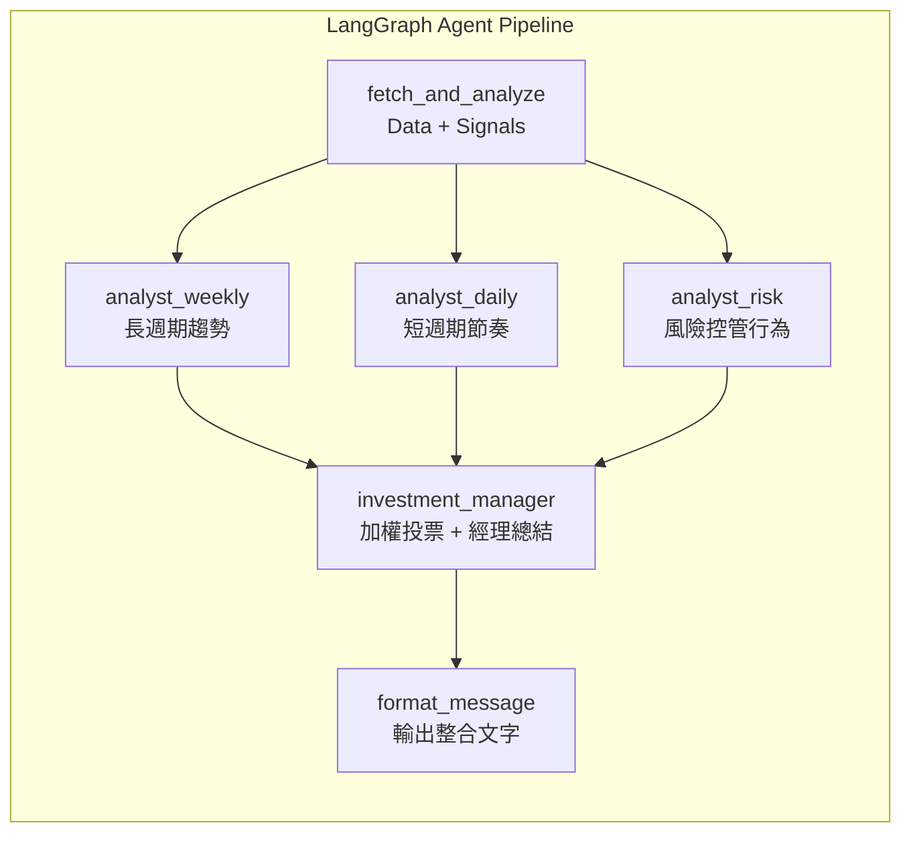

下面是我把你目前 README **依照你最新的 pipeline（`investment_manager` 合併節點 + `format_message` 有 Input/Output trace）** 全面更新後的版本（你可以整段覆蓋 `README.md`）。

> 主要改動點：
>
> * `manager_merge` → ✅ 改成 `investment_manager`（rule-based vote + manager LLM summary）
> * Trace tree / 節點表格 / Mermaid pipeline 全部對齊
> * 移除不再存在或容易誤導的 `build_prompt` span（你現在是把 prompt 組在 analyst/manager node 裡）
> * `format_message` Input/Output 說明補齊（你已修好 Langfuse input 空的問題）

````md
# Crypto-AI-Agent-Framework

以 **LangGraph + Langfuse** 為核心的「可觀測多角色 AI Agent Pipeline」，實作在加密貨幣（目前以 **BTC 現貨** 為主）的投資決策輔助場景。  
系統採用 **三位 LLM 分析師（週線趨勢 / 日線量價節奏 / 風險與倉位控管）** 共同評估，最後由 **投資經理節點（Intent 加權投票 + 經理人 LLM 總結）** 統整成 `buy / hold / sell` 建議，並透過 **LINE Bot** 以自然語言互動回覆；全流程輸入/輸出與每次 LLM 推論皆可在 **Langfuse Trace** 中追蹤與除錯。

---

## 🧾 為什麼需要 Crypto AI Agent？

<!--  -->


傳統在幣圈要做決策，往往需要同時關注：

- 宏觀指標：通膨、利率、就業、貨幣政策…
- 鏈上數據：交易量、資金流向、大戶/礦工動向…
- 幣圈內生指標：期貨資金費率、未平倉量、機構動態、情緒/FUD/FOMO…
- 技術分析：K 線、均線、量價、指標（MACD、RSI、布林帶…）
- 生態趨勢：L2、Rollup、RWA、DeFi、NFT、GameFi、AI 敘事…

對於 **有本業、時間有限的散戶** 來說，很難每天都花大把時間追資訊還要自己下結論。

所以這個專案想做的是：

> 讓 AI Agent 幫忙做「資料整理與大方向判讀」，  
> 我只要在忙碌生活中打開 LINE 問一句「現在 BTC 形勢怎樣？」  
> 就能用 10' 掌握 **長週期趨勢 + 短週期量價狀態 + 風險提醒**。

---

## 🧠 Crypto AI Agent 架構圖

### 初始版本（概念版）

>（LINE → FastAPI → LangChain → Ollama/OpenAI → 回覆 LINE）

```mermaid
flowchart LR
    U["使用者 LINE 聊天"] -->|輸入指令：查 BTC 形勢| L["LINE Messaging API Bot"]

    subgraph GCP["GCP Serverless（Cloud Run ／ Functions）"]
        L --> W["Webhook Handler<br/>(HTTP Endpoint)"]
        W --> D["Data Agent<br/>抓幣安 K 線與量價"]
        D --> A["Analysis Agent<br/>週線 SMA50／100 牛熊判斷<br/>＋ 日線量價放量／縮量"]
        A --> Adv["Advice Agent<br/>呼叫 OpenAI / Ollama LLM"]
        Adv --> W
    end

    W -->|文字訊息| L
    L -->|回覆當前 BTC 形勢與建議| U
````

---

## ✅ 更新版本：LangGraph + Langfuse（可觀測 Pipeline）

> （LINE → FastAPI → LangGraph → LLM → Langfuse → 回覆 LINE）

```mermaid
flowchart LR
    %% 使用者入口
    U[LINE 使用者 / CLI] --> L[LINE Platform]
    L -->|Webhook| A[FastAPI / webhook
    crypto_agent.main]

    %% 啟動 LangGraph
    A -->|run_with_graph
    symbol, user_text| G[LangGraph StateGraph
    crypto_agent.graph_crypto_agent]

    %% LangGraph Pipeline
    subgraph P["LangGraph Pipeline（單一 Trace）"]
        S0((START))

        S0 --> F[fetch_and_analyze
        抓 K 線 / 計算 signals]

        F --> W[analyst_weekly
        週線趨勢分析師
        LLM + signals → JSON]

        F --> D[analyst_daily
        日線量價型態分析師
        LLM + signals → JSON]

        F --> RSK[analyst_risk
        風險 / 倉位控管分析師
        LLM + signals → JSON]

        W --> IM[investment_manager
        加權投票 + 經理人 LLM 總結]
        D --> IM
        RSK --> IM

        IM --> FM[format_message
        轉為 LINE 訊息]

        FM --> E0((END))
    end

    %% 外部服務
    P --> LLM[(Ollama / OpenAI / vLLM / OpenRouter)]
    P --> FUSE[Langfuse
    Traces / Spans]

    %% 回傳使用者
    A -->|reply_message| L --> U
```

### LangGraph（控制流程）

* 定義 **AgentState**（共享狀態）
* 定義節點（nodes）與執行順序
* 保證流程可重現、可擴充

### Langfuse（觀測與除錯）

* **每一次使用者請求 → 一條 Trace**
* 每個節點 → 一個 Span
* 每次 LLM 呼叫 → 一個 Generation（`.llm`）

> 所有節點都在 **同一條 Trace 底下**，可完整看到「資料 → 分析 → LLM → 決策 → 回覆」的時間線

---

## 🗂 專案結構 & 執行方式

```text
crypto_agent/
├ config.py               # API key 與環境變數設定（.env 讀取）
├ data_binance.py         # 從 Binance 拿日線/週線 K 線與量價資料
├ graph_crypto_agent.py   # LangGraph pipeline（節點、state、流程）
├ indicators.py           # 技術指標計算（SMA/Regime）＋日線量價分析
├ line_formatter.py       # 將 final_decision 整合成適合 LINE 顯示的訊息
├ llm_client.py           # LLM 客戶端呼叫（OpenAI / Ollama…）
├ main.py                 # FastAPI + LINE Webhook 主入口（LINE Bot）
├ observability.py        # Langfuse 觀測：SpanCtx / GenCtx / safe_preview
├ run_local.py            # 本地測試腳本（模擬呼叫 Agent pipeline）
├ service.py              # 可選：抽離 webhook handler/service（若你有用到）
├ requirements.txt        # Python 相依套件列表
└ .env                    # 環境變數與敏感 Key（不應提交到 GitHub）
```

> `run_local.py`：可先在本機測試完整流程：
> **抓資料 → 計算技術指標 → 三分析師推論 → 經理決策 → 格式化輸出**
> 確認輸出合理後，再接上 LINE Webhook ＋ 部署到 GCP。

---

## 🔑 本地執行前：建立 `.env`

在 `crypto_agent/` 底下加入 `.env`：

```env
OPENAI_API_KEY=sk-
OPENAI_MODEL=gpt-4o-mini

BINANCE_API_KEY=
BINANCE_API_SECRET=
SYMBOL=BTCUSDT

# ---- LLM backend 選擇( ollama / openai ) ----
LLM_BACKEND=ollama
OLLAMA_MODEL=llama3.2:3b
OLLAMA_BASE_URL=

# ---- Langfuse ----
LANGFUSE_ENABLED=true
LANGFUSE_PUBLIC_KEY=pk-
LANGFUSE_SECRET_KEY=sk-
LANGFUSE_BASE_URL=http://localhost:3000

# ---- Line Bot ----
LINE_CHANNEL_SECRET=
LINE_CHANNEL_ACCESS_TOKEN=
```

---

## 🚀 安裝與執行

### 安裝套件

```bash
pip install -r requirements.txt
```

### 本地跑一次 pipeline（不走 LINE）

```bash
python run_local.py
```

---

## 🧩 若使用 Ollama

```bash
export OLLAMA_HOST=<URL>
ollama pull llama3.2:3b
ollama run llama3.2:3b
```

---

## 🤖 LINE Bot 本機測試（ngrok）

```bash
ngrok http 8000
# 將 ngrok 產出的 URL 貼到 LINE Developer Console 的 webhook URL
```

啟動 FastAPI：

```bash
# 專案根目錄下（依你的實際 module path）
python -m uvicorn crypto_agent.main:app --reload --port 8000

# 或在 crypto_agent 目錄下（若 main.py 在同層）
python -m uvicorn main:app --reload --port 8000
```

---

## 🔭 Observability：Langfuse 觀測整個 Agent Pipeline

* Langfuse docker-compose.yml 參考：
  [https://github.com/langfuse/langfuse/blob/main/docker-compose.yml](https://github.com/langfuse/langfuse/blob/main/docker-compose.yml)

### 啟動本地 Langfuse

在 `crypto_agent/langfuse-local`：

```bash
docker compose up -d
```

* Langfuse Web UI：[http://localhost:3000](http://localhost:3000)
* Postgres / ClickHouse / Redis / Minio 皆在同一個 docker compose 中啟動

---

## ✅ 系統特色

### ✔ 使用者意圖驅動分析（Intent Driven）

系統會從輸入中解析使用者意圖：

| 使用者輸入      | Intent         |
| ---------- | -------------- |
| `BTC 投資建議` | general_advice |
| `我想抄底 BTC` | bottom_fishing |
| `我怕回撤`     | risk_averse    |
| `想賣出 BTC`  | take_profit    |
| `我重倉 BTC`  | heavy_position |

---

### ✔ Intent 加權投票（Rule-based, 可解釋）

根據使用者意圖，調整每位分析師的重要性：

| Intent         | weekly | daily | risk |
| -------------- | ------ | ----- | ---- |
| general_advice | 1.0    | 1.0   | 1.0  |
| bottom_fishing | 0.5    | 1.5   | 1.0  |
| risk_averse    | 0.5    | 1.0   | 1.5  |
| take_profit    | 1.0    | 0.8   | 1.4  |
| heavy_position | 1.0    | 1.2   | 0.8  |

最終結論由 **加權投票得分最高者** 決定（buy/hold/sell）。

---

### ✔ 多分析師共同評估（結構化 JSON）

三位 LLM 分析師各司其職：

* **analyst_weekly** — 週線趨勢分析（是否仍在主要趨勢中）
* **analyst_daily** — 日線量價型態分析（是否適合動作）
* **analyst_risk**  — 風險與倉位控制分析（行為建議）

每位分析師會輸出嚴格 JSON 格式（示意）：

```jsonc
{
  "ok": true,
  "focus": "weekly",
  "decision": "buy|hold|sell",
  "summary": "...",
  "confidence": "high|medium|low",
  "key_levels": {"support":"...", "resistance":"..."},
  "notes": "...",
  "missing": []
}
```

---

### ✔ 投資經理節點：合併「規則」與「自然語言總結」

`investment_manager` 節點做兩件事：

1. **Rule-based**：依 intent 權重對三分析師做加權投票 → 得到 preliminary decision
2. **Manager LLM**：以「投資經理」身份，把三分析師結論與意圖整理成 **自然、專業的繁體中文總結**（用於 `final_decision.summary`）

---

## 🧾 Pipeline（LangGraph）



---

## 🔍 Langfuse Trace（節點與 LLM 呼叫）

### Trace Tree（實際對應）

```text
crypto_agent.run
├ fetch_and_analyze
├ analyst_weekly
│  └ analyst_weekly.llm
├ analyst_daily
│  └ analyst_daily.llm
├ analyst_risk
│  └ analyst_risk.llm
├ investment_manager
│  └ investment_manager.llm
└ format_message
```

### 節點一覽（Langfuse Span 對應）

| Langfuse Span 名稱         | 節點角色                | 說明          |
| ------------------------ | ------------------- | ----------- |
| `crypto_agent.run`       | Root Controller     | 一次完整請求的總控   |
| `fetch_and_analyze`      | Data / Signal Agent | 抓資料＋計算指標    |
| `analyst_weekly`         | 週線趨勢分析師             | 長週期結構判斷     |
| `analyst_weekly.llm`     | LLM 呼叫              | 週線分析師推論     |
| `analyst_daily`          | 日線量價分析師             | 短期節奏判斷      |
| `analyst_daily.llm`      | LLM 呼叫              | 日線分析師推論     |
| `analyst_risk`           | 風險控管分析師             | 行為與風控       |
| `analyst_risk.llm`       | LLM 呼叫              | 風控分析師推論     |
| `investment_manager`     | 投資經理節點              | 加權投票 + 統整決策 |
| `investment_manager.llm` | LLM 呼叫              | 經理人自然語言總結   |
| `format_message`         | Interface Agent     | 組 LINE 回覆訊息 |

---

## 🧠 AgentState（全流程共享狀態）

```python
class AgentState(TypedDict, total=False):
    symbol: str
    user_text: str
    ts: str
    intent: str

    weekly_row: Dict[str, float]
    weekly_regime: str
    daily_pattern: Dict[str, Any]
    daily_candles: List[Dict[str, Any]]

    analyst_weekly: AnalystResult
    analyst_daily: AnalystResult
    analyst_risk: AnalystResult

    final_decision: Dict[str, Any]  # buy/hold/sell + summary + risk
    message: str                   # 最終 LINE 文本
```

---

## 📊 Analysis Agent 指標（週線 Regime + 日線量價）

（以下內容保留你的原文，主要是策略邏輯說明；未來你若加入 RSI/BB 等，再擴充即可）

> 站在「長週期現貨投資者」角度，評估：
> **週線 SMA50／SMA100 牛熊判斷 + 日線量價（放量／縮量）情況**，作為大方向的節奏判斷。

（…此段以下你的原內容可原封不動保留…）

---

## 📌 初版串接成果

 

> 品質有待加強...

### V1

 

> 好了一點

### V2

 

> 有樣子了


---

## 📊 使用示例與輸出

### 👉 一般投資建議

輸入：

```text
BTC 投資建議
```

回傳（示意）：

```text
【BTCUSDT 形勢分析（AI Agent）】

✅ 結論：HOLD

🧠 重點摘要：
近期趨勢仍偏上行，但短期波動較大…

⚠️ 風險提醒：
- 近期波動仍大
- 需密切觀察市場趨勢
```

---

### 👉 抄底意圖

輸入：

```text
我想抄底 BTC
```

回傳（示意）：

```text
【BTCUSDT 形勢分析（AI Agent）】

✅ 結論：BUY

🧠 重點摘要：
若你是「抄底」意圖，建議以分批/條件單方式進行…

⚠️ 風險提醒：
- 若跌破關鍵支撐請重新評估
```

---

## 🛣 未來規劃（Roadmap）

短期：

* [x] 支援切換 LLM backend（Ollama / OpenAI）
* [x] 加入 LINE Messaging API webhook
* [ ] 部署到 GCP Cloud Run
* [x] 解析不同自然語言意圖（抄底 / 怕回撤 / 停利 / 加倉）
* [ ] 增加簡單風險提示（例如：近期高波動、槓桿市場過熱等）

中期：

* [x] LangGraph 工作流化（多節點）
* [x] Langfuse 可觀測 trace/span/generation
* [ ] 加入「簡單記憶」：記錄歷次判斷結果與後續走勢，用來回顧與調整規則

長期：

* [ ] 支援多幣種、多策略組合（非只 BTC）
* [ ] 加入鏈上數據（On-chain）、衍生品指標（Funding / OI / Basis）
* [ ] 研究半自動/全自動下單（需強化風控與監控）

---

## ⚠ 免責聲明

本專案僅作為：

* 個人技術練習
* AI Agent Framework 讀書會展示
* 自用觀察與研究工具

**不構成任何投資建議。**
加密貨幣波動極大，請自行評估風險與資金配置，勿槓桿梭哈、勿過度依賴模型或 AI 判斷。


```

---

如果你願意，我也可以幫你做「更像專業開源專案」的 README 排版版本（加上：Badges、Quickstart、Screenshots、FAQ、Contributing、License），但不會改掉你原本的大段內容，只是把結構變得更好讀。
